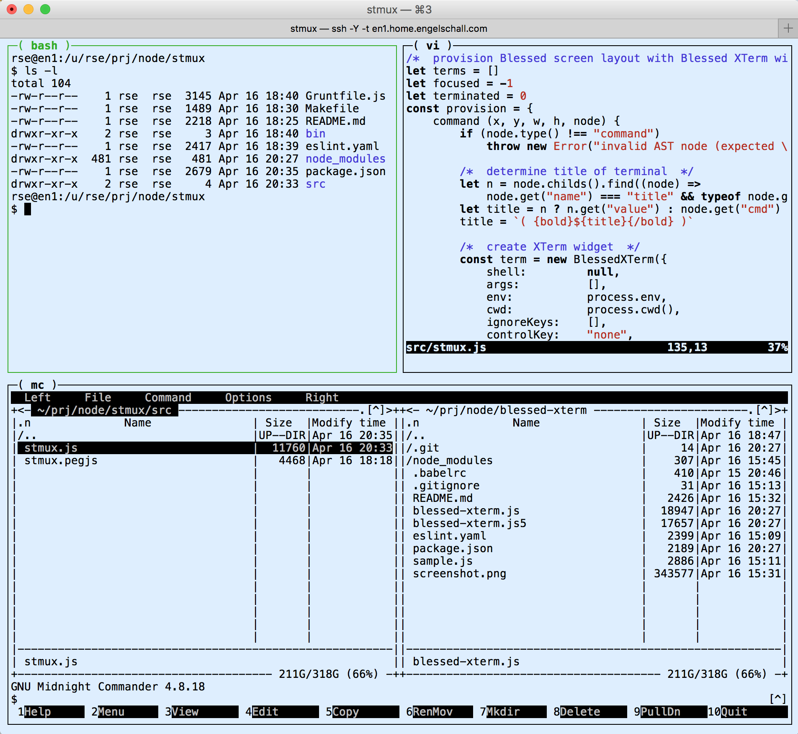

stmux
=====

**Simple Terminal Multiplexing for Node Environments**

<p/>


<p/>


Abstract
--------

This is a simple terminal multiplexing utility for Node.js
environments. It is inspired by the awesome and unreachable
[tmux](https://tmux.github.io/) native Unix utility. The stmux utility
is intended to provide just a very tiny subset of the original
[tmux](https://tmux.github.io/) functionality, but in a portable way for
bare Node.js environments and with some special features for application
build environments. Most notably, stmux has a built-time error
detection and notification feature, can automatically restart terminated commands,
and can automatically close or wait after all spawned commands have
successfully or unsuccessfully terminated.

Example
-------

The following command...

```
$ stmux [ [ bash .. vim ] : mc ]
```

...leads to the following particular terminal multiplexing environment,
where GNU bash, Vim and Midnight Commander are running side-by-side
inside their own XTerm emulating terminal widget:



Intention
---------

This utility is primarily intended to be used from within a
`package.json` `script` to easily side-by-side run various
NPM-based commands in a Node.js build-time environment. For
more sophisticated use-cases please stick with the original
[tmux](https://tmux.github.io/), of course.

Sample `package.json` entries from a top-level NPM-based project
follows, which allows one to run the commands of two sub-projects.
First, the build-time of the frontend user interface (UI) project.
Second, the build-time of the backend server (SV) project.
Third, the run-time of the backend server project.
Forth, an additional regular shell.

```js
{
    ...
    "dependencies": {
        "stmux":      "*"
    },
    "scripts": {
        "install":    "npm run install:ui && npm run install:sv",
        "install:ui": "cd ui && npm install",
        "install:sv": "cd sv && npm install",

        "build":      "npm run build:ui && npm run build:sv",
        "build:ui":   "cd ui && npm run build",
        "build:sv":   "cd sv && npm run build",

        "start":      "cd sv && npm start",

        "clean":      "npm run clean:ui && npm run clean:sv"
        "clean:ui":   "cd ui && npm run clean",
        "clean:sv":   "cd sv && npm run clean",

        "dev":        "stmux -w always -e ERROR -m beep,system -- [ [ \"npm run dev:ui\" .. \"npm run dev:sv\" ] : -s 1/3 -f \"npm start\" ]",
        "dev:ui":     "cd ui && npm run build:watch"
        "dev:sv":     "cd sv && npm run build:watch"
    }
}
```

Installation
------------

```
$ npm install -g stmux
```

### Notice

This module requires the essential Node.js module
[node-pty](https://github.com/Tyriar/node-pty). Unfortunately,
this module contains a native part which has to be built by
[node-gyp](https://github.com/nodejs/node-gyp). Please check out the
documentation of [node-gyp](https://github.com/nodejs/node-gyp) on how
to provide the necessary C/C++ compiler environment on your operating
system. Under Linux or FreeBSD you usually don't have to do anything.
Under macOS you have to install the "Command Line Tools" in Xcode
under "Preferences &gt; Downloads". Under Windows you once have to
open an elevated `CMD.EXE` and run the commands `npm install --global
windows-build-tools` and `npm config set msvs_version 2015 --global`.

Usage
-----

The following command line arguments are supported:

```
$ stmux [-h] [-V] [-w] [-a <activator>] [-t <title>] [-f <file>] [-- <spec>]
```

- `-h`, `--help`<br/>
  Show usage help.
- `-V`, `--version`<br/>
  Show program version information.
- `-w <condition>`, `--wait <condition>`<br/>
  Wait after last finished command (and do not shutdown automatically),
  either if any command terminated with an `error` or just `always`.
- `-a <activator>`, `--activator <activator>`<br/>
  Use `CTRL+<activator>` as the prefix to special commands.
  The default activator character is `a`.
- `-t <title>`, `--title <title>`<br/>
  Set title on terminal. The default title is `stmux`.
- `-c <type>`, `--cursor <type>`<br/>
  Set type of cursor  to `block` (default), `underline` or `line`.
- `-n`, `--number`<br/>
  Show terminal number in terminal title.
- `-e <regexp>[,...]`, `--error <regexp>[,...]`<br/>
  Observe terminal lines for errors (global option).
  One or more regular expressions can be specified and have to match on a single line.
  If a regular expression is preceeded with the prefix `!`, it is
  required that it does not match.
- `-m <methods>`, `--method <methods>`<br/>
  In case of detected errors, use the comma-separated
  list of methods to perform user notification. The default
  is no extra notification (just the terminal annotation).
  Possible methods are `beep` and `system`.
- `-f <file>`, `--file <file>`<br/>
  Read specification `<spec>` from a configuration file. The
  default is to use the specification inside the command line arguments
  or (alternatively) to read the specification from `stdin`.

The following PEG-style grammar loosly describes the specification `<spec>`.
For exact details see the [real PEG grammar of stmux](src/stmux.pegjs).

```
spec      ::= "[" directive (":"  directive)* "]"  /* vertical   split */
            | "[" directive (".." directive)* "]"  /* horizontal split */

directive ::= option* spec                         /* RECURSION */
            | option* string                       /* shell command */

option    ::= ("-f" | "--focus")                   /* focus terminal initially */
            | ("-r" | "--restart")                 /* restart command automatically */
            | ("-d" | "--delay") number            /* delay <number> seconds on restart */
            | ("-t" | "--title") string            /* set title of terminal */
            | ("-s" | "--size") size               /* request a size on terminal */
            | ("-e" | "--error") regexp            /* observe terminal for errors (local option) */

size      ::= /^\d+$/                              /* fixed character size */
            | /^\d+\.\d+$/                         /* total size factor */
            | /^\d+\/\d+$/                         /* total size fraction */
            | /^\d+%$/                             /* total size percentage */
```

The following keystrokes are supported under run-time:

- `CTRL`+*activator* *activator*:<br/>
  Send the `CTRL`+*activator* key-sequence to the focused terminal.
- `CTRL`+*activator* `BACKSPACE`:<br/>
  Switch the focus to the previous terminal in sequence.
- `CTRL`+*activator* `SPACE`:<br/>
  Switch the focus to the next terminal in sequence.
- `CTRL`+*activator* `LEFT`/`RIGHT`/`UP`/`DOWN`:<br/>
  Switch the focus to the best matching terminal in a direction.
- `CTRL`+*activator* `1`/`2`/.../`9`:<br/>
  Directly switch to a particular terminal.
- `CTRL`+*activator* `n`:<br/>
  Toggle showing/hiding of terminal numbers.
- `CTRL`+*activator* `z`:<br/>
  Toggle the zooming of focused terminal.
- `CTRL`+*activator* `v`:<br/>
  Switch the focused terminal into visual/scrolling mode.
  Use `PAGEUP`/`PAGEDOWN` during this mode to scroll up/down.
  Any other key leaves this mode.
- `CTRL`+*activator* `l`:<br/>
  Relayout the screen.
- `CTRL`+*activator* `r`:<br/>
  Restart the program in the focused terminal.
- `CTRL`+*activator* `k`:<br/>
  Kill the application and all shell commands in all terminals.
- `CTRL`+*activator* `?`:<br/>
  Show help window.

Specification Examples
----------------------

- `stmux [ A ]`:

    ```
    +-----------+
    |           |
    |     A     |
    |           |
    +-----------+
    ```

- `stmux [ A .. B ]`:

    ```
    +-----+-----+
    |     |     |
    |  A  |  B  |
    |     |     |
    +-----+-----+
    ```

- `stmux [ A : B ]`:

    ```
    +-----------+
    |     A     |
    +-----------+
    |     B     |
    +-----------+
    ```

- `stmux [ [ A .. B ] : C ]`:

    ```
    +-----+-----+
    |  A  |  B  |
    +-----+-----+
    |     C     |
    +-----------+
    ```

- `stmux [ [ A : B ] .. C ]`:

    ```
    +-----+-----+
    |  A  |     |
    +-----+  C  |
    |  B  |     |
    +-----+-----+
    ```

- `stmux [ [ A : B ] .. [ C : D ] ]`:

    ```
    +-----+-----+
    |  A  |  C  |
    +-----+-----+
    |  B  |  D  |
    +-----+-----+
    ```

- `stmux [ [ A .. B ] : [ C .. D ] ]`:

    ```
    +-----+-----+
    |  A  |  B  |
    +-----+-----+
    |  C  |  D  |
    +-----+-----+
    ```

- `stmux [ [ -s 1/3 A .. B ] : [ C .. -s 1/3 D ] ]`:

    ```
    +---+-------+
    | A |    B  |
    +---+---+---+
    |    C  | D |
    +-------+---+
    ```

License
-------

Copyright (c) 2017 Ralf S. Engelschall (http://engelschall.com/)

Permission is hereby granted, free of charge, to any person obtaining
a copy of this software and associated documentation files (the
"Software"), to deal in the Software without restriction, including
without limitation the rights to use, copy, modify, merge, publish,
distribute, sublicense, and/or sell copies of the Software, and to
permit persons to whom the Software is furnished to do so, subject to
the following conditions:

The above copyright notice and this permission notice shall be included
in all copies or substantial portions of the Software.

THE SOFTWARE IS PROVIDED "AS IS", WITHOUT WARRANTY OF ANY KIND,
EXPRESS OR IMPLIED, INCLUDING BUT NOT LIMITED TO THE WARRANTIES OF
MERCHANTABILITY, FITNESS FOR A PARTICULAR PURPOSE AND NONINFRINGEMENT.
IN NO EVENT SHALL THE AUTHORS OR COPYRIGHT HOLDERS BE LIABLE FOR ANY
CLAIM, DAMAGES OR OTHER LIABILITY, WHETHER IN AN ACTION OF CONTRACT,
TORT OR OTHERWISE, ARISING FROM, OUT OF OR IN CONNECTION WITH THE
SOFTWARE OR THE USE OR OTHER DEALINGS IN THE SOFTWARE.

